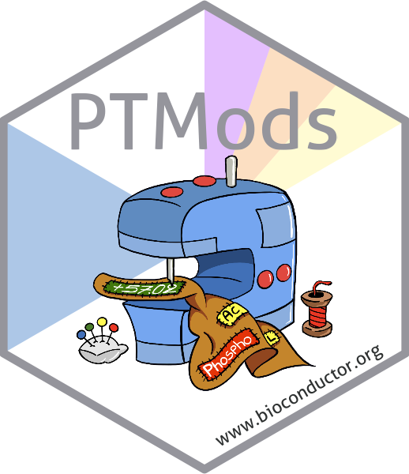
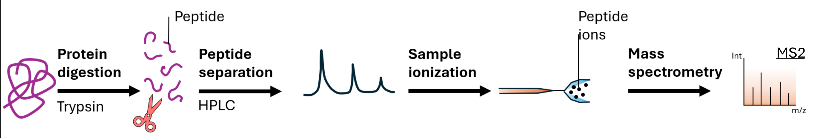
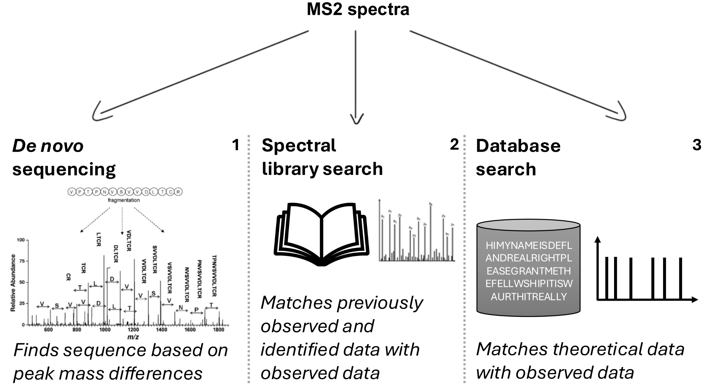
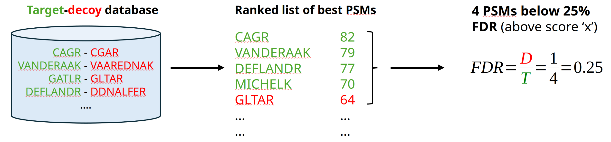
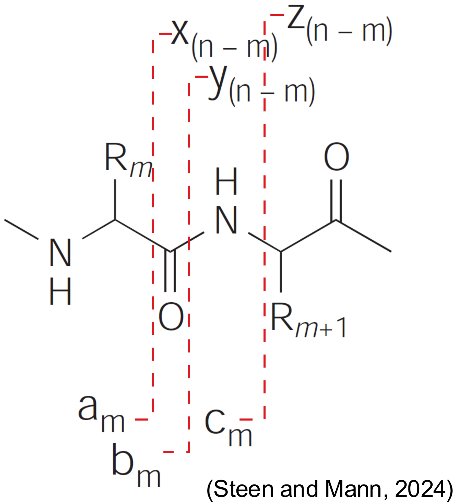

```{r setup, include=FALSE}
knitr::opts_chunk$set(
    echo = TRUE,
    message = FALSE,
    warning = FALSE,
    fig.align = "center",
    fig.retina = 3,
    out.width = "70%"
)

library(xaringanExtra)
use_tile_view()
use_clipboard()
use_panelset()
use_broadcast()
use_webcam()
```

# Code and data availability

**1. Install the PSMatchWorkshop package:**

```{r installWorkshop, eval = FALSE}
remotes::install_github("guideflandre/PSMatchWorkshop", build_vignettes = TRUE)
```

--

**2. Browse the vignettes:**

```{r browseVignettes, eval = FALSE}
vignette("PSMatchWorkshop", package = "PSMatchWorkshop")
vignette("slides", package = "PSMatchWorkshop")
```

--

**3. Workshop _R_ code:** 
["github/guideflandre/PSMatchWorkshop/inst/workshopCode.R"](https://github.com/guideflandre/PSMatchWorkshop/inst/workshopCode.R)

--

**4. [PSMatch](https://github.com/rformassspectrometry/PSMatch), 
[PTMods](https://github.com/rformassspectrometry/PTMods) and 
[Spectra](https://github.com/rformassspectrometry/Spectra) packages:**

```{r installPkg, eval = FALSE}
BiocManager::install("rformassspectrometry/PSMatch@validatePSM")
BiocManager::install("rformassspectrometry/PTMods")
BiocManager::install("Spectra")
```




---

# Workshop outline

.pull-left[
**Part I: Brief recap and introduction**
1. Mass spectrometry-based proteomics
2. From spectra to PSMs

**Part II: Handling identification data with PSMatch**
3. The `PSM` class: loading and exploring
4. Filtering PSM data
5. Peptide-protein relationship and adjacency matrices
]

.pull-right[
**Part III: PTMods and spectrum annotation**

6. PTM annotation styles and conversion
7. Fixed and variable modifications
8. Fragment ions and spectrum visualisation

**Part IV: Validating PSMs** 
9. `validatePSM()` based on different metrics
]

---
class: inverse, center, middle

# Mass spectrometry-based proteomics

---

# Bottom-up proteomics workflow

.center[

]

--

.center[
**MS2 spectra:** fragments = digital foorprints of **peptidoforms**
]


--

.center[
It is **not** proteoforms we identify, but **peptideoforms !**
]

--

.center[
Proteforms (groups) are later inferred based on the identified peptidoforms.
]


---

# From raw spectra to identifications

.center[

]

---

# Peptide-Spectrum Matches (PSMs)

A **PSM** ties an observed MS2 spectrum to a candidate peptide sequence.

Every search engine output, regardless of format, records at minimum:

| Field | Description |
|---|---|
| **Peptide** | The matched amino-acid sequence |
| **Rank** | Position in the scored candidate list for that spectrum |
| **Spectrum ID** | Scan number / spectrum identifier |
| **Protein(s)** | The protein(s) the peptide maps to |
| **Score** | Search engine confidence score |
| **FDR** | False discovery rate estimate at that score |
| **Decoy flag** | Whether the hit is a target or decoy |


---

# Target-decoy competition, scoring and FDR


---
class: inverse, center, middle

# PSMatch


---

# Who is PSMatch for?

**Explore, filter, and annotate** identification results after a search.

.pull-left[
### You have just run a search engine and want to…
- Import the results into R
- Filter low-confidence hits
- Understand protein ambiguity
- Visualise and annotate matched spectra
]

--

.pull-right[
### PSMatch will not…
- Run the database search itself
- Replace your search engine scores (a.k.a rescoring tools)
- Perform quantification

]

---

# Installing the packages

```{r installVlatest, eval = FALSE}
## Development versions (required for this workshop)
remotes::install_github(c(
    "rformassspectrometry/PSMatch@validatePSM",
    "rformassspectrometry/PTMods"
), build_vignettes = TRUE)
```

```{r load, message = FALSE}
library(PSMatch)
library(PTMods)
library(Spectra)
```

---

# Example data

For this workshop, 2 example datasets will be used.

One is already bundled within the PSMatch package. The other is available
through `MsDataHub()`. 

Their origin is of no importance for the workshop, but if you are interested,
use `?MsDataHub::Boekweg2022` and 
`?MsDataHub::TMT_Erwinia_1uLSike_Top10HCD_isol2_45stepped_60min_01.20141210.mzid`.

Both were acquired after a database search.

```{r load-data, eval = FALSE}
## Data bundled in PSMatch
data("psmBoekweg")

## Data from MsDataHub
f <- MsDataHub::TMT_Erwinia_1uLSike_Top10HCD_isol2_45stepped_60min_01.20141210.mzid()
```

---

# The PSM() constructor

`PSM` is a lightweight extension of `DFrame` (S4Vectors):

- Every **row** is one PSM
- Columns are search engine output variables
- Key variables (spectrum, peptide, protein, …) are **named** on construction

```{r psm-load, eval = FALSE}
psms <- PSM(
    x = psmBoekweg,
    spectrum = "pkey", 
    peptide = "peptide",
    protein = "protein",
    decoy = "label",
    rank = "rank",
    score = "hyperscore",
    fdr = "spectrum_q"
)
psms
```

---

# Exploring a PSM object

```{r psm-vars, eval = FALSE}
psmVariables(psms) ## named vector of the column mappings you defined
names(psms) ## all column names
```

--

PSM objects from **mzIdentML** files are constructed identically:

```{r id-load, eval = FALSE}
id <- PSM(
    x = f,
    spectrum = "spectrumID",
    peptide = "sequence",
    protein = "DatabaseAccess",
    decoy = "isDecoy",
    rank = "rank",
    score = "MS.GF.RawScore",
    fdr = "MS.GF.QValue"
)
```

---

# Target-decoy approach

.pull-left[
- Decoy hits are used to **estimate the FDR**.
- `TargetDecoy::evalTargetDecoysHist()` checks the quality of the
  target-decoy score distributions.
]

.pull-right[
```{r tdc, eval = FALSE}
evalTargetDecoysHist(
    data.frame(psms),
    decoy  = "label",
    score  = "sage_discriminant_score",
    log10  = FALSE,
    nBins  = 80
)
```
]


---

# Multiple matches per spectrum

A search engine can return **more than one candidate** per spectrum.

## Reducing PSMs

When multiple matches exist, you can either:

1. **Filter**: keep only rank-1 hits, remove shared peptides
2. **Reduce**: collapse multiple rows into one per spectrum

```{r reduce, eval = FALSE}
idReduced <- reducePSMs(id, id$spectrumID)
anyDuplicated(idReduced$spectrumID) ## 0: one row per spectrum
```

---

# Shared peptides

A **shared peptide** is a peptide whose sequence is present in more than
one protein.

--

**Consequence**: the protein of origin cannot be determined from the
peptide alone: this creates **protein ambiguity**.

We will come back to this in a moment.

---

class: inverse, center, middle

# Filtering PSM data

---

# Why filter?

Raw search output contains:

- **Decoy hits**: needed for FDR estimation, not biological
- **Rank > 1 hits**: lower-confidence alternative candidates
- **Shared peptides**: ambiguous protein assignments
- **High-FDR hits**: below the confidence threshold

PSMatch provides a targeted function for each case, plus a convenience
wrapper.

---

# Filtering functions

| Function | What it removes |
|---|---|
| `filterPsmDecoy()` | Decoy hits (`isDecoy == TRUE`) |
| `filterPsmRank()` | Hits with rank > 1 |
| `filterPsmShared()` | Peptides mapping to > 1 protein |
| `filterPsmFdr()` | Hits above the FDR threshold (default 5 %) |
| `filterPSMs()` | Applies decoy + rank + shared in one call |

```{r filters, eval = FALSE}
id |> filterPSMs() ## decoy, rank, shared
psms |> filterPsmFdr(FDR = 0.01)
```

---
class: inverse, center, middle

# Protein ambiguity & adjacency matrices

---

# The protein ambiguity problem

A PSM table hides an important structure: the **peptide-protein
relationship**.

.pull-left[
- **Unique peptides** map to exactly one protein: unambiguous.
- **Shared peptides** map to two or more proteins: the protein of
  origin cannot be determined from the peptide alone.
- Two proteins that share a peptide are **connected**.
]

.pull-right[
```{r describe, eval = FALSE}
describePeptides(psms)
describeProteins(psms)
```
]

---

# The adjacency matrix concept

`makeAdjacencyMatrix()` models the peptide-protein relationship as a
**sparse matrix**:

- **Rows** = peptides
- **Columns** = proteins
- **Entry (i, j)** > 0 if peptide *i* was observed for protein *j*

Values can be:
- **Binary** (1/0): presence/absence
- **Counts**: number of PSMs
- **Weighted**: sum of scores

```{r adj-build, eval = FALSE}
psmsFiltered <- psms |> filterPsmDecoy() |> filterPsmRank()
adj <- makeAdjacencyMatrix(psmsFiltered, binary = TRUE) ## binary
adj <- makeAdjacencyMatrix(psmsFiltered) ## weighted (sum of scores)
adj <- makeAdjacencyMatrix(psmsFiltered, score = NA) ## counts
```

---

# Connected components

The full matrix is too large to interpret: split it into **connected
components**: groups of peptides and proteins that share at least one link.

```{r cc-build, eval = FALSE}
cc <- ConnectedComponents(adj)
```

--

Four component types:

| Type | Proteins | Peptides |
|---|---|---|
| Trivial/unique | 1 | 1 |
| Well-identified protein | 1 | > 1 |
| Shared-peptide ambiguity | > 1 | 1 |
| Complex group | > 1 | > 1 |

---

# Prioritising components for inspection

`prioritiseConnectedComponents()` scores every component on a set of
structural metrics (dimensions, sparsity, modularity, …).

```{r cc-prioritise, eval = FALSE}
cctab <- prioritiseConnectedComponents(cc)
```

--

A PCA of these metrics helps spot outliers that deserve attention first:

```{r cc-pca, eval = FALSE}
library("factoextra")
fviz_pca(prcomp(cctab, scale = TRUE, center = TRUE))
```

---
class: inverse, center, middle

# Handling Post-Translational Modifications


---

# What are PTMs?

**Post-Translational Modifications (PTMs)** are chemical modifications
that occur on amino acids after translation.

Common examples:
- **Oxidation** (e.g. on methionine): +15.995 Da
- **Phosphorylation** (e.g. on serine, threonine): +79.966 Da
- **Carbamidomethylation** (e.g. on cysteine): +57.021 Da
- **Acetylation** (e.g. on N-terminus, lysine): +42.011 Da

PTMs change the **mass** of the peptide and thus affect both precursor
and fragment ion masses.

---

# Different annotation styles

Different search engines use different syntaxes for the same modification:

| Style | Example | Used by |
|---|---|---|
| `deltaMass` | `M[+15.994915]PEPTIDE` | Sage |
| `unimodId` | `M[UNIMOD:35]PEPTIDE` | (MSFragger) |
| `name` | `M[Oxidation]PEPTIDE` | MaxQuant |

**PTMods** handles all three, using an up-to-date mapping from
[unimod.org](https://www.unimod.org).

--

```{r ptmods-convert, eval = FALSE}
## Name → deltaMass
convertAnnotation("M[Oxidation]PEPTIDE", convertToStyle = "deltaMass")

## deltaMass → name
convertAnnotation("M[+15.995]PEPTIDE", convertToStyle = "name")
```

---

# Fixed and variable modifications

.pull-left[
### Fixed modifications
- Applied to **every** eligible residue
- Unconditional
- Example: carbamidomethylation on all cysteines

```{r ptmods-fixed, eval = FALSE}
addFixedModifications()
```
]

.pull-right[
### Variable modifications
- **May or may not** be present
- Generates all possible combinations
- Example: oxidation on methionine

```{r ptmods-var-preview, eval = FALSE}
addVariableModifications()
```
]

---
class: inverse, center, middle

# Fragment ions & spectrum visualisation

---

# Theoretical fragment ions

**How are peptides identified?**

1. MS2 spectrum contains observed fragment ions (peaks)
2. Search engine generates **theoretical** fragment ions from candidate
   sequences
3. Matching observed to theoretical peaks scores the identification

--

**b- and y-ion series** are the most common fragment types:

.center[

]

---

# Generating theoretical fragments

`calculateFragments()` computes the theoretical m/z values for all
standard ion types from a given peptide sequence.

Supports PTMs via `PTMods`.

```{r frag-concept, eval = FALSE}
## Unmodified peptide
calculateFragments("PEPTIDE")

## Modified peptide: fragment masses will differ
calculateFragments("M[Oxidation]PEPTIDE")
```

---

# Visualising annotated spectra

`plotSpectraPTM()` overlays theoretical fragments on an observed MS2
spectrum:

The figure shows:

1. **Sequence coverage**: which b/y ions were matched
2. **Annotated spectrum**: peaks coloured by ion type (b, y, etc.)
3. **ΔMz plot**: observed minus theoretical m/z (quality check)

---
class: inverse, center, middle

# Validating PSMs

---

# Why validate?

`validatePSM()` adds **per-PSM spectral and identification metrics** not
reported by search engines.

```{r validate, eval = FALSE}
res <- validatePSM(sp[1:20],
    peptideVariable = psmVar["peptide"],
    fdr = psmVar["fdr"]
)
res
```

---
class: center, middle

# Thank you

.large[Thank you for your attention]

`r Sys.Date()`
